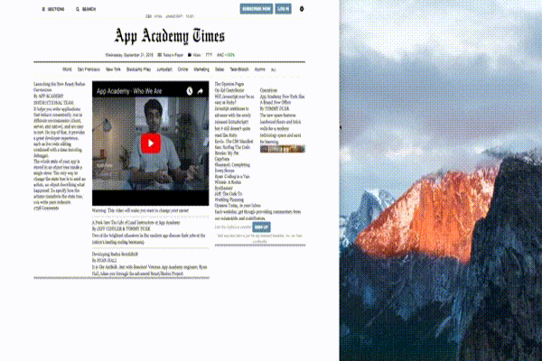

# App Academy Times

## File Structure

Begin by becoming familiar with the file structure:

```
/app/assets/stylesheets
+-- base
|   +-- colors.scss
|   +-- fonts.scss
|   +-- grid.scss
|   +-- layout.scss
|   +-- reset.scss
+-- components
|   +-- _main_nav.scss
|   +-- _example.scss
+-- application.scss
```

Take a look at the application.scss file:

```css
// CSS Reset
@import "reset.scss";

// Core
@import "colors.scss";
@import "fonts.scss";
@import "layout.scss";

// Grid
@import "grid.scss";

// Components
@import "components/*";
```

The file is using SASS imports in order to create general styles applied to our entire application and enforce the importing of these stylesheets in a particular order.

This implementation of multiple SASS file importing is [recommended by Rails][rails-pipeline]. Take a peek at the `colors.scss` & `fonts.scss` files that establish SASS variables for you to use throughout styling the application. This makes changing fonts or colors for your entire application much easier.

[rails-pipeline]: http://guides.rubyonrails.org/asset_pipeline.html#manifest-files-and-directives

Some notes on this project before starting:

- Sometimes the html will be given and you must style it yourself, sometimes the styles will be given and you must provide the html structure, and sometimes you will be required to do code both.
- Html is rendered using rails partials to allow styling of each component separately. This aligns with the future of coding components using `React.js`
- Images may be found in the `app/assets/images` folder
- Javascript files are provided in the `app/assets/javascripts` folder
- A script tag in the application.html.erb file loads [fontawesome](http://fontawesome.io/icons/) icon classes
- Text content is given in separate text files within the `app/assets/text` folder for you to copy and paste.

## Reset

Start with a clean slate, by "resetting" the user agent stylesheet provided by the browser with a `stylesheets/base/reset.scss` file. We provided the tag selectors to get you started. Be wise about which properties to inherit, and which to hard-code. 

- Set the `box-sizing` property to inherit, to have all elements behave the same, which is `content-box`, by default.
- Make all images `block` elements, have them expand to the full
`100%` width of their parent container, and have their height grow
`auto`, which means proportionally
- Remove the bullets from list items
- Strip the default styling from form input elements by setting their appearance to none (see [here][appearance-info])
- Show the pointer hand on buttons to make it obvious for users to click
- Include the clearfix in your code

[appearance-info]: https://css-tricks.com/almanac/properties/a/appearance/

## Layout

Start by looking over the design and annotated_design screenshots.

In order to write "cascading" style sheets it is important that we pick out common design elements and essential layout features. We will refer back to this `layout.scss` file when styling aspects common to our entire application.

Notice that all of the content is within a **defined content region** annotated as being `80%` width. A **defined content region** is essential for user experience because it makes text content easier to read.

- Apply the content region styling to the `body` element
- Center the body using the `margin: 0 auto;` trick
- Use the `font-family: $sans-serif` for the base font
- Use `12px` as the deafult `font-size`

A great use for the `layout.scss` stylesheet is to code common button styling for your projects. Keeping button styling consistent makes it easier for users to know where to click.

- style buttons according to the `annotated_screenshot.jpg`
- add a `transition: background-color 0.3s`
- add the `button:hover` styling

# Phase 1: The Header

With our layout styling started we can now begin focusing on each component. Notice that we can break the header down into a `main-navigation`, a `masthead` with the logo and a `sections_nav`. 

Breaking down stylesheets into components like this will be essential to developing maintanable code. After coding each section we will return to the main navigation and style the gear dropdown. 

## Main Nav

Compare the provided html structure in `/views/shared/_header.html.erb` to the design. Notice we are missing the right side navigation.

- add another `<nav>` for the right side
- add the buttons
- add the gear icon inside of a button so that it has a `cursor: pointer`

Now it is time to style in the `_main_nav.scss` file. For this section we have provided the selectors for you. Here are some tips:

- `flex` the main navigation and use `justify-content` to calculate spacing
- Use the `text-transform` property on the `left-nav`
- The `vertical-align` property will align text on the y-axis

## MastHead

Open up the `_masthead.html.erb` file in `app/assets/views/shared` split screen next to the provided `_masthead.scss` file.

First copy and paste all of the text content from `app/assets/text/masthead.txt` and then build the html structure around it. Here are some tips:

- Notice that the `.masthead` is a flex parent which means it will be used as a containing html element and all immediate child elements will become flex-children
- The `align-items` property centers the flex-children horizontally
- The Rails Asset Pipeline takes care of precompiling our assets, so the correct filepath for images in the `assets/images` folder is `assets/example_image.jpg`
- Only list elements should be present within unordered lists, but list elements may contain other elements such as anchor tags or buttons

After some html structuring you will notice some problems with the styling. Fix the following items:

- correctly position the language-nav
- remove last border from masthead-links
- make the first link in language-nav bold
- add application styling for anchor tags using the `layout.scss` file

## Sections Nav

Place your styles in the `_sections_nav.scss` file and html in the `_sections_nav.html.erb` file. Once you have fully completed the sections navigation bar **call over a TA for review**.

## Gear Dropdown

Open up the `javascripts/components` folder and take a look at the `dropdown.js` file. Read the comments to get an understanding how the script works. 

- Add the necessary id attribute to the gear icon in the header

Open the `_gear_dropdown.html.erb` file where we have created the html structure of the dropdown. Notice the classes used to divide the different unordered lists and the span elements for the subtitles. 

This adheres to the rule that only list elements should be children of unordererd lists but list elements themselves may have children of all types including other unordered lists.

- Add the partial as a child of the gear icon element using `<%= render partial: 'shared/gear_dropdown' %>`

It's time to style the dropdown:

- Apply the necessary positioning properties for a standard dropdown
- Give the dropdown some background, padding, and a border
- Using a defined px `width` for a dropdown is perfectly acceptable
- The `z-index` property is used on positioned elements to place them in front of or behind other elements with the largest `z-index` being in front
- Style the remaining fonts and margins being sure to use propper selectors

For a final touch apply some `box-shadow` to the dropdown to give it a bit more dimension. Box Shadows are highly customizable with values for the `x-offset`, `y-offset`, `blur-radius`, `spread-radius` and `color`. Here is an example using `rgba` colors where the `Alpha` value makes the color super transparent.

```
    box-shadow: -1px 4px 6px 1px rgba(0,0,0,0.09);
```

# Phase 2: The Main Content

For the next phase we will be adding some of the latest App Academy Times news in a grid-like html structure. 

Use the `app/assets/copy` folder to copy and paste in some content for each section and then build the html around it. But first, let's make sure we have a flexible website by using a grid system.

## Custom Flexible Grid

Grids are much less complicated than they sound but are used all throughout the web. Popular style frameworks like `bootstrap` by Twitter and `material` by Google all use flexible grid systems. For App Academy Times, we will handroll a simple grid just like in the [CSS Homework][css-grid-homework]. 

Please don't just copy and paste this code. Typing and Debugging CSS/HTML is the best way to learn. Make sure to include the media query with a nice break point that maintains your design at all screen sizes.



[css-grid-homework]: https://github.com/appacademy/curriculum/blob/master/html-css/assets/custom_grid.css

## News Content

Once you have a grid system setup copy in all the content from `app/assets/copy/main_content.txt` and build the necessary html structure around it. Use your grid classes and section elements to define the flexible content columns.

- Use [Video Link][app-academy-video] and go to the Embed tab underneath Share in order to get the necessary iframe code from YouTube
- Within the iframe, change the `width` to `100%` and the `height` to `300`

Style the colors, fonts and spacing for each element in the main_content section according to the screenshot provided in `app/assets/screenshots`. Here are some tips:

- We used <hr> elements and classes for `.hr-top`, `.hr-bottom` to get the lines separating pieces of content
- We used a pseudo content `:after` and `content = ''` to create a blue square next to the comments link
- Using `flex: 1` on the input element will force it to grow or shrink to take up all the space next to it's flex sibling Sign Up button
- Place the new office image inside of a div with a class. Style the div to be a certain height in px and then make the image `width: 100%` & `height: 100%`. Finally use the `object-fit: cover` styling on the image to assure it covers the containing div correctly.

**Get A TA to Review your page before continuing**

[app-academy-video]: https://www.youtube.com/watch?v=ARe9FupzuOA

# Phase 3: The Sections Sidebar

Notice that our flexible website breaks a bit because we don't have flexible fonts. We will leave this discussion for another time and instead use media queries to complete our responsive design. The main issue lies within the sections nav where the amount of links is too big for smaller screen sizes.

- Write a media query similar to the one used in the `grid.scss` to hide the sections nav at the same viewport width that the columns convert to 100%
- Write a similar media query to hide the language nav
- We will fix the header buttons on the smallest screen sizes later

The language nav content is still available in the gear dropdown but now we need to code the sections sidebar so that mobile users still have a way of navigating the many App Academy Times Sections.

- Copy and paste the html from the `sections_nav.html.erb` file into the `sections_sidebar.html.erb` file as a starting point
- Take a look at the `sections_sidebar.js` to see how the sidebar functions
- Add the `<%= render partial: 'shared/sections_sidebar'` to the `_header.html.erb` as a child of the `sections-sidebar-btn`
- Take a look at the `sections_sidebar.png` screenshot to see the additional html and styling we need
- Add the remaining html to the `sections_sidebar` by nesting additional `ul` elements within the `li` elements that require an additional dropdown
- Make sure to provide classes corresponding to the `sections_sidebar.js` file
- Style according to the screenshot

# Phase 4: Search Modal

Modals are distinct from dropdowns because they appear to float independently over the application. A common characteristic of a modal is also that the app beneath becomes more opaque and clicking away from the modal will close it.

Take a look at the `search-modal.png` screenshot to get a better idea of what this is supposed to look like. Use the `search-modal.js` file to get the id necesary for the search button.

Create the html in the `_search_modal.html.erb` file and style in `_search_modal.scss`.

# Phase 5: Finalizing the Header

- hide the subscribe now and login buttons for the smallest screen sizes
  - make these links available in the gear dropdown
- when scrolling past the sections_nav a fixed sections_nav header should appear


